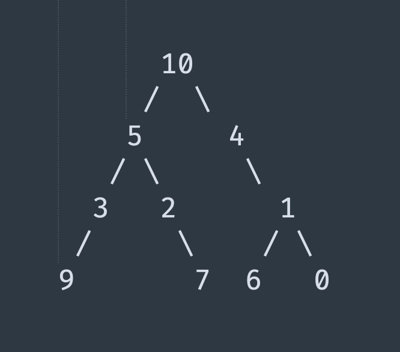

# Можно ответить на любой из вопросов (или на все)
## Задача 1
```
Напишите код на любом языке программирования.
Задача:
Дан упорядоченный массив целых чисел, нужно написать программу, которая будет получать упорядоченный массив квадратов этих чисел.
Исходный массив может содержать отрицательные числа, ноль и положительные числа.
Пример:
-2, -1, 1, 5 -> 1, 1, 4, 25
-10, -1, 0, 1, 3 -> 0, 1, 1, 9, 100
```
## Задача 2
```
Напишите код на любом языке программирования.
Задача:
Реализовать алгоритм печати бинарного дерева
Пример дерева на изображении
```


## Задача 3
Что бы вы концептуально улучшили в этом коде?

[test.cs](./test.cs.txt)

Это задание можно сделать без знаний языка C#.
т е комментарии "тут нужна точка с запятой можно не писать"